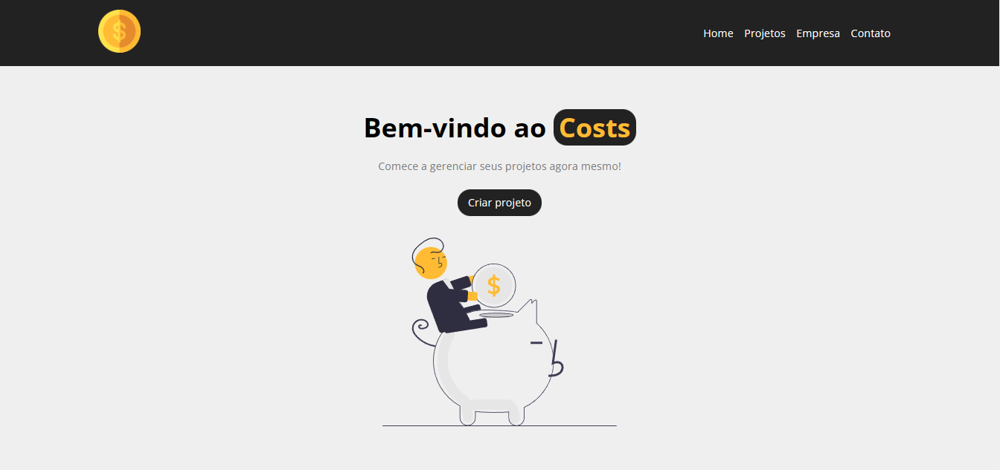

<h1 align="center">Costs</h1>

  <a href="#-tecnologias">Tecnologias</a>&nbsp;&nbsp;&nbsp;|&nbsp;&nbsp;&nbsp;
  <a href="#-projeto">Projeto</a>&nbsp;&nbsp;&nbsp;|&nbsp;&nbsp;&nbsp;
  <a href="#-layout">Layout</a>

 

  

## 🚀 Tecnologias

Esse projeto foi desenvolvido com as seguintes tecnologias:

- JavaScript
- [ReactJS](https://reactjs.org/)
- [SASS](https://sass-lang.com/)
- [Vite](https://vitejs.dev/)
- [Npm](https://www.npmjs.com/)

## 💻 Projeto

Aplicação voltado para auxiliar a criação e manutenção de projetos.

- [x] Organize as despesas, custos e serviços dos projetos.
- [x] Separe projetos por categorias.
- [x] Adicione serviços.
